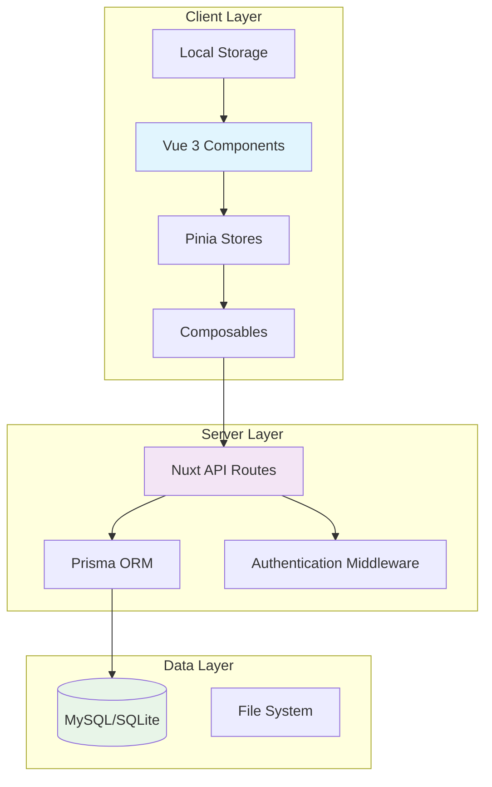

# Design Document

## Overview

The cat meal management feature is designed as a comprehensive food tracking system for multiple cats within a private network environment. The system will be built using Nuxt 3 with TypeScript, leveraging Prisma ORM for database operations, and supporting both MySQL (production) and SQLite (development) databases.

The architecture follows a modern full-stack approach with server-side rendering capabilities, offline-first design principles, and responsive UI components that work seamlessly across Mac and iOS devices.

## Architecture

### System Architecture



### Technology Stack Integration

- **Frontend**: Nuxt 3 with Vue 3 Composition API, TypeScript strict mode
- **Styling**: Tailwind CSS v4 + UnoCSS for utility-first styling
- **State Management**: Pinia v3 with auto-imports
- **Form Handling**: VueUse forms with Zod validation
- **Database**: Prisma ORM supporting MySQL (production) and SQLite (development)
- **Authentication**: JWT + Cookie-based custom implementation
- **Offline Support**: Local Storage with sync capabilities

## Components and Interfaces

### Core Components

#### 1. Meal Recording Components

**MealRecordForm.vue**

- Purpose: Primary form for recording meal data
- Props: `catId?: string`, `editMode?: boolean`, `initialData?: MealRecord`
- Features:
  - Cat selection dropdown
  - Food type selection with search/filter
  - Quantity input (grams/calories with conversion)
  - Date/time picker
  - Predefined quantity buttons
- Validation: Zod schema for all inputs

**MealRecordList.vue**

- Purpose: Display meal history with filtering
- Props: `catId?: string`, `dateRange?: DateRange`
- Features:
  - Infinite scroll/pagination
  - Edit/delete actions
  - Filter by cat, date range, food type
  - Responsive card layout

#### 2. Cat Management Components

**CatProfileCard.vue** (existing, to be enhanced)

- Purpose: Display cat information
- Enhancements needed:
  - Add meal statistics
  - Quick meal recording button
  - Health indicators

**CatManagementForm.vue**

- Purpose: Add/edit cat profiles
- Fields: name, birthdate, weight, photo
- Validation: Required fields, date validation

#### 3. Food Management Components

**FoodManagementForm.vue**

- Purpose: Add/edit food items
- Fields: name, type (dry/wet), calories per gram, price
- Features: Auto-complete for existing brands/names

**FoodSelector.vue**

- Purpose: Reusable food selection component
- Features: Search, filter by type, recent selections

#### 4. Data Visualization Components

**MealChart.vue**

- Purpose: Display meal data in various chart formats
- Chart Types: Line chart (default), bar chart (mode toggle)
- Data: Daily calories, food type breakdown
- Library: Chart.js or similar lightweight solution

#### 5. Offline Support Components

**SyncStatus.vue**

- Purpose: Display sync status and offline indicator
- Features: Connection status, pending sync count, manual sync trigger

### API Interfaces

#### REST API Endpoints

```typescript
// Meal Records
GET    /api/meals              // List meals with filtering
POST   /api/meals              // Create meal record
PUT    /api/meals/:id          // Update meal record
DELETE /api/meals/:id          // Delete meal record

// Cats
GET    /api/cats               // List cats
POST   /api/cats               // Create cat
PUT    /api/cats/:id           // Update cat
DELETE /api/cats/:id           // Delete cat

// Foods
GET    /api/foods              // List foods
POST   /api/foods              // Create food
PUT    /api/foods/:id          // Update food
DELETE /api/foods/:id          // Delete food

// Data Visualization
GET    /api/analytics/meals    // Meal analytics data

// Sync
POST   /api/sync               // Sync offline data
GET    /api/sync/status        // Get sync status
```

## Data Models

### Database Schema (Prisma)

```prisma
model Cat {
  id        String   @id @default(cuid())
  name      String
  birthdate DateTime?
  weight    Float?
  photoUrl  String?
  createdAt DateTime @default(now())
  updatedAt DateTime @updatedAt

  meals     MealRecord[]

  @@map("cats")
}

model Food {
  id            String   @id @default(cuid())
  name          String
  type          FoodType
  brand         String?
  caloriesPerGram Float
  pricePerUnit  Float?
  unit          String   @default("g")
  createdAt     DateTime @default(now())
  updatedAt     DateTime @updatedAt

  meals         MealRecord[]

  @@map("foods")
}

model MealRecord {
  id          String   @id @default(cuid())
  catId       String
  foodId      String
  quantity    Float    // in grams
  calories    Float    // calculated or manual
  mealTime    DateTime
  notes       String?
  createdAt   DateTime @default(now())
  updatedAt   DateTime @updatedAt

  cat         Cat      @relation(fields: [catId], references: [id], onDelete: Cascade)
  food        Food     @relation(fields: [foodId], references: [id], onDelete: Restrict)

  @@map("meal_records")
}

enum FoodType {
  DRY
  WET
}
```

### TypeScript Interfaces

```typescript
// Core Types
interface Cat {
  id: string;
  name: string;
  birthdate?: Date;
  weight?: number;
  photoUrl?: string;
  createdAt: Date;
  updatedAt: Date;
}

interface Food {
  id: string;
  name: string;
  type: "DRY" | "WET";
  brand?: string;
  caloriesPerGram: number;
  pricePerUnit?: number;
  unit: string;
}

interface MealRecord {
  id: string;
  catId: string;
  foodId: string;
  quantity: number;
  calories: number;
  mealTime: Date;
  notes?: string;
  cat?: Cat;
  food?: Food;
}

// Form Types
interface MealRecordInput {
  catId: string;
  foodId: string;
  quantity: number;
  calories?: number;
  mealTime: Date;
  notes?: string;
}

// Analytics Types
interface MealAnalytics {
  dailyCalories: { date: string; calories: number; type: "DRY" | "WET" }[];
  weeklyAverage: number;
  foodTypeBreakdown: { type: "DRY" | "WET"; percentage: number }[];
}
```

## Error Handling

### Client-Side Error Handling

1. **Form Validation Errors**

   - Real-time validation using Zod schemas
   - User-friendly error messages in Japanese
   - Field-level error highlighting

2. **API Error Handling**

   - Global error interceptor using Nuxt plugins
   - Retry mechanism for network failures
   - Graceful degradation for offline scenarios

3. **Offline Error Handling**
   - Queue failed requests for retry
   - Show appropriate offline indicators
   - Conflict resolution for sync operations

### Server-Side Error Handling

1. **Database Errors**

   - Connection failure handling
   - Transaction rollback on errors
   - Constraint violation handling

2. **Authentication Errors**

   - JWT token validation
   - Session expiration handling
   - Unauthorized access responses

3. **Validation Errors**
   - Input validation using Zod
   - Consistent error response format
   - Detailed error messages for debugging

## Testing Strategy

### Unit Testing (Vitest)

1. **Component Testing**

   - Form validation logic
   - Data transformation functions
   - Composable functions
   - Store actions and getters

2. **API Testing**
   - Route handlers
   - Database operations
   - Authentication middleware
   - Data validation

### Integration Testing (@nuxt/test-utils)

1. **Page Testing**

   - Full page rendering
   - Navigation flows
   - Form submissions
   - Data fetching

2. **API Integration**
   - End-to-end API workflows
   - Database integration
   - Authentication flows

### E2E Testing (Playwright)

1. **User Workflows**

   - Complete meal recording flow
   - Cat and food management
   - Data visualization
   - Offline/online sync

2. **Cross-Device Testing**
   - Desktop (Mac) scenarios
   - Mobile (iOS Safari) scenarios
   - Responsive design validation

### Performance Testing

1. **Load Testing**

   - API response times (<1 second requirement)
   - Database query optimization
   - Large dataset handling

2. **Offline Performance**
   - Local storage operations
   - Sync performance
   - Memory usage monitoring

## Security Considerations

### Authentication & Authorization

1. **JWT Implementation**

   - Secure token generation and validation
   - Cookie-based storage with httpOnly flag
   - Token refresh mechanism

2. **Network Security**
   - Private network restriction
   - HTTPS enforcement
   - CORS configuration

### Data Protection

1. **Database Security**

   - Data encryption at rest
   - Secure connection strings
   - Input sanitization

2. **Client-Side Security**
   - XSS prevention
   - CSRF protection
   - Secure local storage handling

## Offline Support Implementation

### Data Synchronization Strategy

1. **Local Storage Structure**

   - Store last 30 days of meal records
   - Cache cat and food master data
   - Track sync timestamps

2. **Conflict Resolution**

   - Last-write-wins for simple conflicts
   - User intervention for complex conflicts
   - Merge strategies for non-conflicting changes

3. **Sync Process**
   - Background sync when online
   - Manual sync trigger
   - Progress indicators for large syncs

## Responsive Design Strategy

### Breakpoint Strategy

1. **Mobile First Approach**

   - Base styles for mobile (iOS Safari)
   - Progressive enhancement for larger screens
   - Touch-friendly interactions

2. **Breakpoints**

   - Mobile: < 768px (iPhone)
   - Tablet: 768px - 1024px
   - Desktop: > 1024px (Mac)

3. **Component Adaptations**
   - Form layouts: Single column (mobile) → Multi-column (desktop)
   - Navigation: Bottom tabs (mobile) → Sidebar (desktop)
   - Charts: Simplified (mobile) → Full featured (desktop)

### Performance Optimization

1. **Code Splitting**

   - Route-based splitting
   - Component lazy loading
   - Dynamic imports for charts

2. **Asset Optimization**

   - Image optimization
   - CSS purging
   - JavaScript minification

3. **Caching Strategy**
   - Service worker for offline assets
   - API response caching
   - Static asset caching
