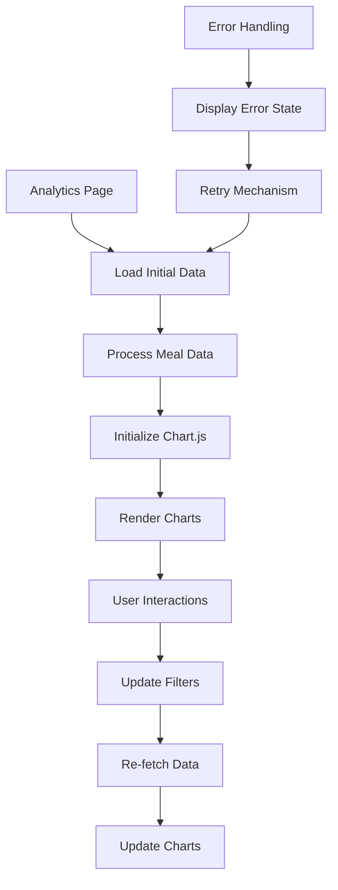

# Design Document

## Overview

This design addresses the chart rendering issues on the analytics page by implementing a robust Chart.js integration with proper error handling, performance optimization, and debugging capabilities. The solution will provide reliable data visualization for cat meal tracking with responsive design and smooth user interactions.

## Architecture

### Component Structure

```
pages/analytics.vue
├── MealChart.vue (Enhanced)
│   ├── Chart.js Integration Layer
│   ├── Data Processing Module
│   ├── Error Handling Module
│   └── Debug Information Panel
├── ChartFilters.vue
│   ├── Cat Selection
│   ├── Date Range Picker
│   └── Chart Type Toggle
└── ErrorBoundary.vue
    ├── Error Display
    └── Retry Mechanism
```

### Data Flow



## Components and Interfaces

### Enhanced MealChart Component

**File**: `components/MealChart.vue`

**Props Interface**:

```typescript
interface MealChartProps {
  catId?: string
  dateRange: {
    start: Date
    end: Date
  }
  chartType: 'line' | 'bar' | 'stacked-bar'
  showDebug?: boolean
}
```

**Key Features**:

- Chart.js lifecycle management
- Responsive design with proper cleanup
- Error boundary integration
- Performance optimization with data caching
- Debug information panel

### Chart Filters Component

**File**: `components/ChartFilters.vue`

**Functionality**:

- Cat selection dropdown
- Date range picker with presets
- Chart type toggle (line/bar/stacked-bar)
- Filter state persistence

### Error Boundary Component

**File**: `components/ErrorBoundary.vue`

**Features**:

- Graceful error handling
- User-friendly error messages in Japanese
- Retry mechanism
- Error reporting for debugging

## Data Models

### Chart Data Structure

```typescript
interface ChartDataPoint {
  date: string
  catId: string
  catName: string
  totalCalories: number
  dryFoodCalories: number
  wetFoodCalories: number
  mealCount: number
}

interface ProcessedChartData {
  labels: string[]
  datasets: ChartDataset[]
  isEmpty: boolean
  dateRange: {
    start: Date
    end: Date
  }
}

interface ChartDataset {
  label: string
  data: number[]
  backgroundColor?: string
  borderColor?: string
  type?: 'line' | 'bar'
}
```

### API Response Structure

```typescript
interface MealAnalyticsResponse {
  success: boolean
  data: {
    dailyCalories: ChartDataPoint[]
    summary: {
      totalMeals: number
      averageCalories: number
      dateRange: {
        start: string
        end: string
      }
    }
  }
  error?: string
}
```

## Error Handling

### Error Types and Responses

1. **Data Fetch Errors**
   - Network connectivity issues
   - API server errors
   - Invalid response format

2. **Chart Rendering Errors**
   - Chart.js initialization failures
   - Invalid data format
   - Canvas rendering issues

3. **User Input Errors**
   - Invalid date ranges
   - Missing required filters

### Error Display Strategy

```typescript
interface ErrorState {
  type: 'network' | 'rendering' | 'validation' | 'unknown'
  message: string
  details?: string
  retryable: boolean
  timestamp: Date
}
```

**Error Messages (Japanese)**:

- Network: "データの取得に失敗しました。ネットワーク接続を確認してください。"
- Rendering: "グラフの表示に問題が発生しました。ページを再読み込みしてください。"
- No Data: "選択した期間にデータがありません。"
- Validation: "入力内容に問題があります。設定を確認してください。"

## Testing Strategy

### Unit Tests

**Files**: `tests/components/MealChart*.test.ts`

**Test Coverage**:

- Chart.js initialization and cleanup
- Data processing and transformation
- Error handling scenarios
- Responsive behavior
- Filter interactions

### Integration Tests

**Files**: `tests/integration/analytics-page.test.ts`

**Test Scenarios**:

- End-to-end chart rendering
- Filter interactions with data updates
- Error recovery flows
- Performance under load

### E2E Tests

**Files**: `tests/e2e/data-visualization.spec.ts`

**User Flows**:

- Navigate to analytics page and view charts
- Filter by cat and date range
- Switch between chart types
- Handle error scenarios gracefully

## Performance Optimization

### Data Caching Strategy

```typescript
interface CacheEntry {
  key: string
  data: ProcessedChartData
  timestamp: Date
  ttl: number
}

class ChartDataCache {
  private cache = new Map<string, CacheEntry>()
  
  get(filters: ChartFilters): ProcessedChartData | null
  set(filters: ChartFilters, data: ProcessedChartData): void
  invalidate(pattern?: string): void
}
```

### Chart.js Optimization

- **Lazy Loading**: Load Chart.js only when needed
- **Animation Control**: Disable animations for large datasets
- **Data Decimation**: Implement data point reduction for performance
- **Memory Management**: Proper cleanup of chart instances

### Responsive Design

- **Breakpoint Strategy**: Mobile-first responsive design
- **Touch Optimization**: Enhanced touch interactions for mobile
- **Performance Monitoring**: Track rendering performance metrics

## Debug Information Panel

### Development Mode Features

```typescript
interface DebugInfo {
  chartInstance: Chart | null
  dataFetchTime: number
  renderTime: number
  dataPoints: number
  memoryUsage: number
  errors: ErrorLog[]
  apiCalls: ApiCallLog[]
}
```

**Debug Panel Sections**:

1. **Performance Metrics**: Render times, data fetch duration
2. **Data Information**: Number of data points, date ranges
3. **Chart.js Status**: Instance state, configuration
4. **API Calls**: Request/response details, timing
5. **Error Log**: Detailed error information with stack traces

### Production Monitoring

- **Error Tracking**: Capture and log chart rendering errors
- **Performance Metrics**: Monitor chart load times
- **User Analytics**: Track chart usage patterns
- **Health Checks**: Verify chart functionality

## Implementation Approach

### Phase 1: Core Chart Functionality

- Fix Chart.js initialization issues
- Implement basic line and bar charts
- Add responsive design support

### Phase 2: Enhanced Features

- Add stacked bar chart support
- Implement filter functionality
- Add error handling and retry mechanisms

### Phase 3: Optimization and Debug

- Performance optimization
- Debug information panel
- Comprehensive testing

### Phase 4: Polish and Monitoring

- UI/UX improvements
- Production monitoring
- Documentation updates
