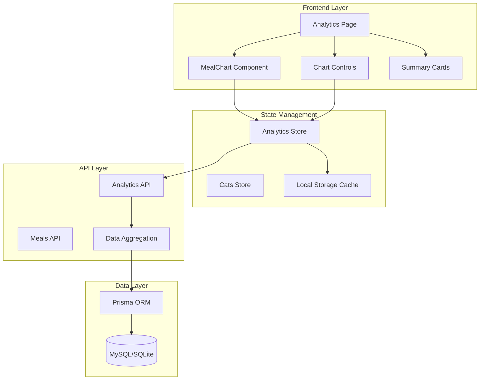

# デザイン文書

## 概要

飼い猫の健康管理アプリにおけるデータ可視化機能のデザインを定義します。この機能は、既存のChart.jsベースの実装を拡張し、要件で定義された食事データの可視化機能を提供します。

## アーキテクチャ



## コンポーネント設計

### 1. Analytics Page (`pages/analytics.vue`)

**目的**: データ可視化機能のメインページ

**機能**:

- 猫選択フィルター
- 期間選択フィルター
- チャート表示エリア
- サマリーカード表示
- クイックアクション

**既存実装の拡張点**:

- フード種別フィルターの追加
- 表示モード切り替え（LineChart/BarChart）
- レスポンシブデザインの改善

### 2. MealChart Component (`components/MealChart.vue`)

**目的**: 食事データのチャート表示

**機能**:

- LineChart表示（食事量推移）
- BarChart表示（積み上げ棒グラフ）
- フード種別フィルタリング
- 期間選択
- レスポンシブ対応

**既存実装の拡張点**:

- 積み上げ棒グラフの実装
- フード種別別表示の改善
- タッチデバイス対応の強化

### 3. Analytics Store (`stores/analytics.ts`)

**目的**: データ可視化の状態管理

**機能**:

- データキャッシュ管理
- フィルター状態管理
- チャートデータ変換
- エラーハンドリング

**既存実装の拡張点**:

- 積み上げ棒グラフ用データ変換
- パフォーマンス最適化
- オフライン対応の強化

## データモデル

### MealAnalytics Interface

```typescript
interface MealAnalytics {
  dailyCalories: DailyCalorieData[];
  weeklyAverage: number;
  foodTypeBreakdown: FoodTypeBreakdown[];
  totalMeals: number;
  averageCaloriesPerMeal: number;
}

interface DailyCalorieData {
  date: string; // YYYY-MM-DD format
  calories: number;
  type: FoodType;
  weight?: number; // グラム
}

interface FoodTypeBreakdown {
  type: FoodType;
  percentage: number;
  totalCalories: number;
  totalWeight: number;
}
```

### Chart Configuration Types

```typescript
interface ChartDisplayOptions {
  chartType: 'line' | 'bar';
  foodTypeFilter: FoodType | 'all';
  period: 7 | 14 | 30 | 60 | 90;
  showWeight: boolean;
  showCalories: boolean;
}

interface ChartData {
  labels: string[];
  datasets: ChartDataset[];
}

interface ChartDataset {
  label: string;
  data: number[];
  backgroundColor: string | string[];
  borderColor: string | string[];
  borderWidth?: number;
  fill?: boolean;
  tension?: number;
}
```

## UI/UXデザイン

### 1. レイアウト構造

```
┌─────────────────────────────────────┐
│ Page Header                         │
├─────────────────────────────────────┤
│ Filter Controls                     │
│ ┌─────────┐ ┌─────────┐ ┌─────────┐ │
│ │Cat      │ │Period   │ │Food Type│ │
│ │Selector │ │Selector │ │Filter   │ │
│ └─────────┘ └─────────┘ └─────────┘ │
├─────────────────────────────────────┤
│ Chart Display Area                  │
│ ┌─────────────────────────────────┐ │
│ │                                 │ │
│ │        Chart.js Canvas          │ │
│ │                                 │ │
│ └─────────────────────────────────┘ │
├─────────────────────────────────────┤
│ Chart Controls                      │
│ ┌─────────┐ ┌─────────────────────┐ │
│ │Chart    │ │Display Options      │ │
│ │Type     │ │☑ Show Calories      │ │
│ │Toggle   │ │☑ Show Weight        │ │
│ └─────────┘ └─────────────────────┘ │
├─────────────────────────────────────┤
│ Summary Cards                       │
│ ┌─────┐ ┌─────┐ ┌─────┐ ┌─────────┐ │
│ │Total│ │Daily│ │Week │ │Food Type│ │
│ │Cal. │ │Avg. │ │Avg. │ │Breakdown│ │
│ └─────┘ └─────┘ └─────┘ └─────────┘ │
└─────────────────────────────────────┘
```

### 2. レスポンシブデザイン

**デスクトップ (1024px+)**:

- 4カラムレイアウト
- 大きなチャートサイズ (800x400px)
- サイドバー形式のフィルター

**タブレット (768px-1023px)**:

- 2カラムレイアウト
- 中サイズチャート (600x350px)
- 折りたたみ可能フィルター

**モバイル (767px以下)**:

- 1カラムレイアウト
- 小サイズチャート (350x250px)
- スタック形式のフィルター

### 3. カラーパレット

```css
:root {
  /* Primary Colors */
  --chart-primary: #3b82f6;      /* Blue */
  --chart-secondary: #22c55e;    /* Green */
  --chart-tertiary: #f59e0b;     /* Amber */
  
  /* Food Type Colors */
  --dry-food-color: #3b82f6;     /* Blue */
  --wet-food-color: #22c55e;     /* Green */
  
  /* Background Colors */
  --chart-bg: rgba(59, 130, 246, 0.1);
  --card-bg: #ffffff;
  --section-bg: #f8fafc;
  
  /* Text Colors */
  --text-primary: #1f2937;
  --text-secondary: #6b7280;
  --text-muted: #9ca3af;
}
```

## インタラクション設計

### 1. チャート操作

**LineChart**:

- ホバー時にデータポイント表示
- クリックで詳細情報表示
- ズーム機能（デスクトップ）
- パン機能（タッチデバイス）

**BarChart**:

- 積み上げ表示でフード種別内訳
- セグメントクリックで詳細表示
- レジェンドクリックで表示/非表示切り替え

### 2. フィルター操作

**猫選択**:

- ボタン形式の選択UI
- アクティブ状態の視覚的フィードバック
- 複数猫の比較表示（将来拡張）

**期間選択**:

- プリセット期間ボタン
- カスタム期間選択（将来拡張）
- 期間変更時のスムーズなアニメーション

**フード種別フィルター**:

- ドロップダウン選択
- 「すべて」「ドライのみ」「ウェットのみ」
- リアルタイムフィルタリング

### 3. 表示モード切り替え

**チャートタイプ**:

- トグルボタンでLineChart/BarChart切り替え
- 切り替え時のスムーズなトランジション
- 選択状態の永続化（localStorage）

## パフォーマンス設計

### 1. データ取得最適化

**キャッシュ戦略**:

- Analytics Store内でのメモリキャッシュ
- 5分間のTTL設定
- フィルター条件別キャッシュキー

**API最適化**:

- 必要なデータのみ取得
- ページネーション対応（大量データ）
- データ圧縮（gzip）

### 2. レンダリング最適化

**Chart.js最適化**:

- データセット更新時の差分レンダリング
- アニメーション設定の最適化
- メモリリーク防止（chart.destroy()）

**Vue.js最適化**:

- computed プロパティでのデータ変換
- v-memo ディレクティブの活用
- コンポーネントの遅延読み込み

### 3. モバイル最適化

**タッチ操作**:

- タッチイベントの最適化
- スクロール性能の向上
- バウンス効果の無効化

**画面サイズ対応**:

- 動的チャートサイズ調整
- フォントサイズの自動調整
- タッチターゲットサイズの確保

## エラーハンドリング

### 1. データ取得エラー

**ネットワークエラー**:

- リトライ機能（最大3回）
- オフライン時のキャッシュデータ表示
- エラーメッセージの表示

**データ不整合**:

- 異常値の検出と除外
- データ欠損の明示
- フォールバック表示

### 2. 表示エラー

**チャート描画エラー**:

- Canvas要素の存在確認
- Chart.js初期化エラーのハンドリング
- 代替表示（テーブル形式）

**レスポンシブエラー**:

- 画面サイズ変更時の再描画
- オリエンテーション変更対応
- 最小サイズ制限

## セキュリティ考慮事項

### 1. データアクセス制御

**認証確認**:

- ページアクセス時の認証状態確認
- API呼び出し時のトークン検証
- セッション期限切れ時の適切な処理

**データフィルタリング**:

- ユーザー所有データのみ表示
- 不正なパラメータの検証
- SQLインジェクション対策

### 2. クライアントサイドセキュリティ

**XSS対策**:

- ユーザー入力のサニタイズ
- innerHTML使用の回避
- CSP（Content Security Policy）の設定

## テスト戦略

### 1. ユニットテスト

**コンポーネントテスト**:

- MealChart コンポーネントの描画テスト
- フィルター操作のテスト
- エラー状態のテスト

**ストアテスト**:

- Analytics Store のアクションテスト
- データ変換ロジックのテスト
- キャッシュ機能のテスト

### 2. 統合テスト

**API統合テスト**:

- データ取得フローのテスト
- エラーハンドリングのテスト
- パフォーマンステスト

### 3. E2Eテスト

**ユーザーシナリオテスト**:

- チャート表示フローのテスト
- フィルター操作のテスト
- レスポンシブ表示のテスト

## 実装優先度

### Phase 1: 基本機能強化

1. 積み上げ棒グラフの実装
2. フード種別フィルターの改善
3. レスポンシブデザインの最適化

### Phase 2: UX改善

1. アニメーション効果の追加
2. タッチ操作の最適化
3. エラーハンドリングの強化

### Phase 3: 高度な機能

1. データエクスポート機能
2. 比較表示機能
3. 予測分析機能（将来拡張）
