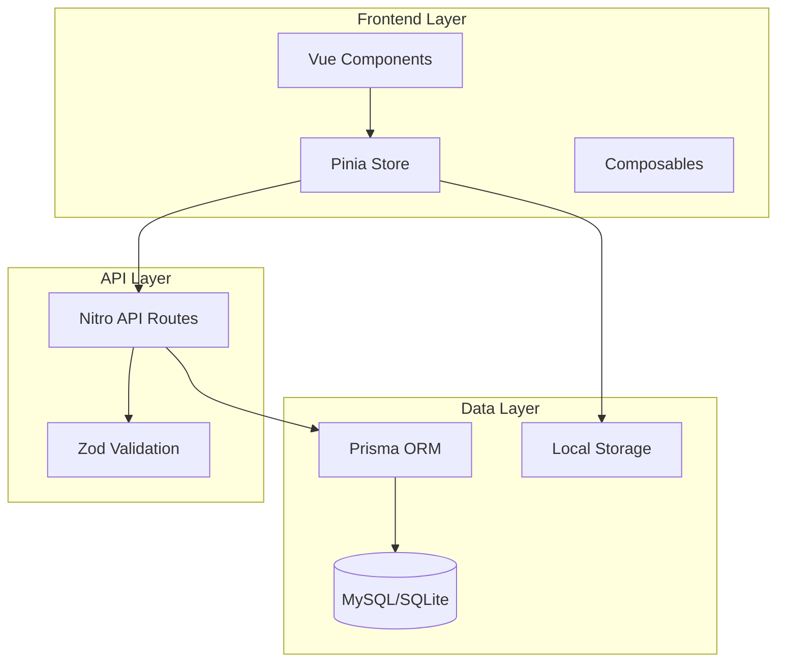
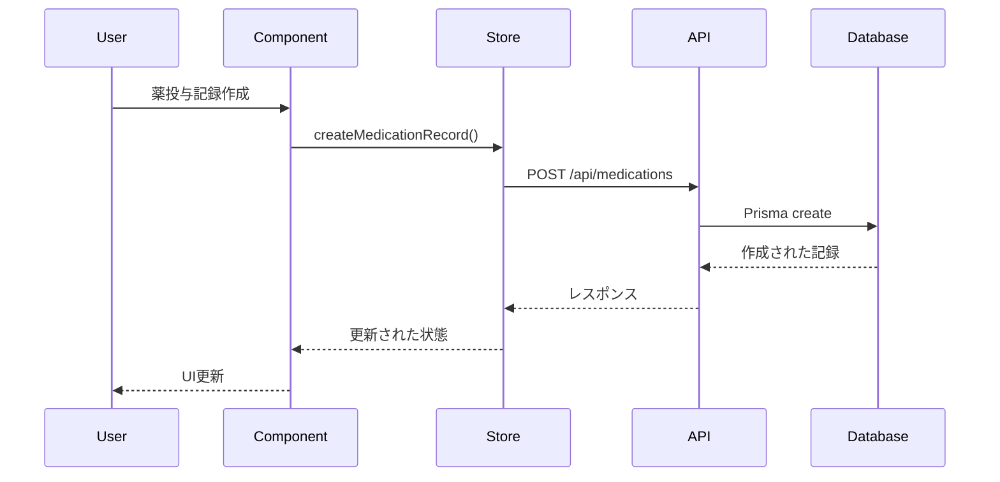

# Design Document

## Overview

薬管理機能は、飼い猫の健康管理アプリにおける薬やサプリメントの投与記録を管理する機能です。この機能は既存のアプリケーションアーキテクチャに統合され、食事管理機能と同様のパターンを使用して実装されます。

主要な機能：

- 薬の種類の登録・管理
- 投与記録の作成・編集・削除
- カレンダー形式の UI
- リマインダー機能
- 投与ステータス管理
- 複数猫対応
- オフライン対応

## Architecture

### System Architecture



### Data Flow



## Components and Interfaces

### Database Schema

```prisma
model Medication {
  id          String   @id @default(cuid())
  name        String
  type        MedicationType
  description String?
  dosage      String?  // 投与量の説明
  createdAt   DateTime @default(now())
  updatedAt   DateTime @updatedAt

  records     MedicationRecord[]
  schedules   MedicationSchedule[]

  @@map("medications")
}

model MedicationRecord {
  id           String   @id @default(cuid())
  catId        String
  medicationId String
  quantity     Int      // 投与個数
  administeredAt DateTime
  status       MedicationStatus @default(PENDING)
  notes        String?
  createdAt    DateTime @default(now())
  updatedAt    DateTime @updatedAt

  cat          Cat      @relation(fields: [catId], references: [id], onDelete: Cascade)
  medication   Medication @relation(fields: [medicationId], references: [id], onDelete: Restrict)

  @@map("medication_records")
}

model MedicationSchedule {
  id           String   @id @default(cuid())
  catId        String
  medicationId String
  frequency    String   // "daily", "twice_daily", "weekly", etc.
  times        String[] // ["08:00", "20:00"] for twice daily
  startDate    DateTime
  endDate      DateTime?
  isActive     Boolean  @default(true)
  createdAt    DateTime @default(now())
  updatedAt    DateTime @updatedAt

  cat          Cat      @relation(fields: [catId], references: [id], onDelete: Cascade)
  medication   Medication @relation(fields: [medicationId], references: [id], onDelete: Restrict)

  @@map("medication_schedules")
}

model MedicationReminder {
  id           String   @id @default(cuid())
  scheduleId   String
  catId        String
  medicationId String
  scheduledAt  DateTime
  status       ReminderStatus @default(PENDING)
  createdAt    DateTime @default(now())
  updatedAt    DateTime @updatedAt

  schedule     MedicationSchedule @relation(fields: [scheduleId], references: [id], onDelete: Cascade)
  cat          Cat      @relation(fields: [catId], references: [id], onDelete: Cascade)
  medication   Medication @relation(fields: [medicationId], references: [id], onDelete: Restrict)

  @@map("medication_reminders")
}

enum MedicationType {
  MEDICINE
  SUPPLEMENT
  VITAMIN
}

enum MedicationStatus {
  PENDING
  ADMINISTERED
  SKIPPED
  MISSED
}

enum ReminderStatus {
  PENDING
  ACKNOWLEDGED
  SNOOZED
  DISMISSED
}
```

### TypeScript Interfaces

```typescript
// Core entity interfaces
export interface Medication {
  id: string;
  name: string;
  type: MedicationType;
  description?: string;
  dosage?: string;
  createdAt: Date;
  updatedAt: Date;
}

export interface MedicationRecord {
  id: string;
  catId: string;
  medicationId: string;
  quantity: number;
  administeredAt: Date;
  status: MedicationStatus;
  notes?: string;
  createdAt: Date;
  updatedAt: Date;
  cat?: Cat;
  medication?: Medication;
}

export interface MedicationSchedule {
  id: string;
  catId: string;
  medicationId: string;
  frequency: string;
  times: string[];
  startDate: Date;
  endDate?: Date;
  isActive: boolean;
  createdAt: Date;
  updatedAt: Date;
  cat?: Cat;
  medication?: Medication;
}

export interface MedicationReminder {
  id: string;
  scheduleId: string;
  catId: string;
  medicationId: string;
  scheduledAt: Date;
  status: ReminderStatus;
  createdAt: Date;
  updatedAt: Date;
  schedule?: MedicationSchedule;
  cat?: Cat;
  medication?: Medication;
}

// Input interfaces
export interface MedicationInput {
  name: string;
  type: MedicationType;
  description?: string;
  dosage?: string;
}

export interface MedicationRecordInput {
  catId: string;
  medicationId: string;
  quantity: number;
  administeredAt: Date;
  status?: MedicationStatus;
  notes?: string;
}

export interface MedicationScheduleInput {
  catId: string;
  medicationId: string;
  frequency: string;
  times: string[];
  startDate: Date;
  endDate?: Date;
}

// Enums
export enum MedicationType {
  MEDICINE = "MEDICINE",
  SUPPLEMENT = "SUPPLEMENT",
  VITAMIN = "VITAMIN",
}

export enum MedicationStatus {
  PENDING = "PENDING",
  ADMINISTERED = "ADMINISTERED",
  SKIPPED = "SKIPPED",
  MISSED = "MISSED",
}

export enum ReminderStatus {
  PENDING = "PENDING",
  ACKNOWLEDGED = "ACKNOWLEDGED",
  SNOOZED = "SNOOZED",
  DISMISSED = "DISMISSED",
}
```

### API Endpoints

```typescript
// Medications
GET    /api/medications           // 薬一覧取得
POST   /api/medications           // 薬作成
GET    /api/medications/:id       // 薬詳細取得
PUT    /api/medications/:id       // 薬更新
DELETE /api/medications/:id       // 薬削除

// Medication Records
GET    /api/medication-records    // 投与記録一覧取得
POST   /api/medication-records    // 投与記録作成
GET    /api/medication-records/:id // 投与記録詳細取得
PUT    /api/medication-records/:id // 投与記録更新
DELETE /api/medication-records/:id // 投与記録削除

// Medication Schedules
GET    /api/medication-schedules  // スケジュール一覧取得
POST   /api/medication-schedules  // スケジュール作成
GET    /api/medication-schedules/:id // スケジュール詳細取得
PUT    /api/medication-schedules/:id // スケジュール更新
DELETE /api/medication-schedules/:id // スケジュール削除

// Medication Reminders
GET    /api/medication-reminders  // リマインダー一覧取得
POST   /api/medication-reminders  // リマインダー作成
PUT    /api/medication-reminders/:id // リマインダー更新
DELETE /api/medication-reminders/:id // リマインダー削除
```

### Vue Components

```typescript
// Core Components
MedicationList.vue; // 薬一覧表示
MedicationForm.vue; // 薬作成・編集フォーム
MedicationRecordForm.vue; // 投与記録フォーム
MedicationRecordList.vue; // 投与記録一覧
MedicationCalendar.vue; // カレンダー表示
MedicationScheduleForm.vue; // スケジュール設定フォーム
MedicationReminder.vue; // リマインダー表示
MedicationStatusBadge.vue; // ステータス表示

// Utility Components
MedicationSelector.vue; // 薬選択コンポーネント
MedicationTypeSelector.vue; // 薬タイプ選択
FrequencySelector.vue; // 投与頻度選択
TimeSelector.vue; // 時間選択
```

### Pinia Store

```typescript
// stores/medications.ts
export const useMedicationsStore = defineStore('medications', {
  state: () => ({
    medications: [] as Medication[],
    records: [] as MedicationRecord[],
    schedules: [] as MedicationSchedule[],
    reminders: [] as MedicationReminder[],
    loading: false,
    error: null as string | null
  }),

  getters: {
    getMedicationById: (state) => (id: string) =>
      state.medications.find(m => m.id === id),
    getRecordsByCat: (state) => (catId: string) =>
      state.records.filter(r => r.catId === catId),
    getTodaysReminders: (state) => // 今日のリマインダー
    getPendingReminders: (state) => // 未処理のリマインダー
  },

  actions: {
    // Medications
    async fetchMedications(),
    async createMedication(input: MedicationInput),
    async updateMedication(id: string, input: Partial<MedicationInput>),
    async deleteMedication(id: string),

    // Records
    async fetchMedicationRecords(filter?: MedicationRecordFilter),
    async createMedicationRecord(input: MedicationRecordInput),
    async updateMedicationRecord(id: string, input: Partial<MedicationRecordInput>),
    async deleteMedicationRecord(id: string),

    // Schedules
    async fetchMedicationSchedules(catId?: string),
    async createMedicationSchedule(input: MedicationScheduleInput),
    async updateMedicationSchedule(id: string, input: Partial<MedicationScheduleInput>),
    async deleteMedicationSchedule(id: string),

    // Reminders
    async fetchReminders(),
    async acknowledgeReminder(id: string),
    async snoozeReminder(id: string, minutes: number),
    async dismissReminder(id: string)
  }
})
```

## Data Models

### Medication Entity

薬の基本情報を管理するエンティティ：

- **id**: 一意識別子
- **name**: 薬名
- **type**: 薬のタイプ（薬、サプリメント、ビタミン）
- **description**: 説明（任意）
- **dosage**: 投与量の説明（任意）

### MedicationRecord Entity

投与記録を管理するエンティティ：

- **id**: 一意識別子
- **catId**: 対象猫の ID
- **medicationId**: 薬の ID
- **quantity**: 投与個数
- **administeredAt**: 投与日時
- **status**: 投与ステータス（予定、投与済み、スキップ、未投与）
- **notes**: メモ（任意）

### MedicationSchedule Entity

投与スケジュールを管理するエンティティ：

- **id**: 一意識別子
- **catId**: 対象猫の ID
- **medicationId**: 薬の ID
- **frequency**: 投与頻度（daily, twice_daily, weekly 等）
- **times**: 投与時間の配列
- **startDate**: 開始日
- **endDate**: 終了日（任意）
- **isActive**: アクティブフラグ

### MedicationReminder Entity

リマインダーを管理するエンティティ：

- **id**: 一意識別子
- **scheduleId**: スケジュール ID
- **catId**: 対象猫の ID
- **medicationId**: 薬の ID
- **scheduledAt**: 予定日時
- **status**: リマインダーステータス

## Error Handling

### Validation Errors

Zod スキーマを使用した入力値検証：

```typescript
// lib/validations/medication.ts
export const MedicationInputSchema = z.object({
  name: z
    .string()
    .min(1, "薬名は必須です")
    .max(100, "薬名は100文字以内で入力してください"),
  type: z.nativeEnum(MedicationType, {
    errorMap: () => ({ message: "有効な薬のタイプを選択してください" }),
  }),
  description: z
    .string()
    .max(500, "説明は500文字以内で入力してください")
    .optional(),
  dosage: z
    .string()
    .max(100, "投与量は100文字以内で入力してください")
    .optional(),
});

export const MedicationRecordInputSchema = z.object({
  catId: z.string().min(1, "猫を選択してください"),
  medicationId: z.string().min(1, "薬を選択してください"),
  quantity: z
    .number()
    .int()
    .min(1, "投与個数は1以上で入力してください")
    .max(100, "投与個数は100以下で入力してください"),
  administeredAt: z.date({
    errorMap: () => ({ message: "有効な日時を入力してください" }),
  }),
  status: z.nativeEnum(MedicationStatus).optional(),
  notes: z.string().max(500, "メモは500文字以内で入力してください").optional(),
});
```

### API Error Handling

統一されたエラーレスポンス形式：

```typescript
// server/api/medications/index.post.ts
export default defineEventHandler(async (event) => {
  try {
    // バリデーション
    const body = await readBody(event);
    const medicationData = MedicationInputSchema.parse(body);

    // 処理
    const medication = await prisma.medication.create({
      data: medicationData,
    });

    return medication;
  } catch (error) {
    if (error instanceof z.ZodError) {
      throw createError({
        statusCode: 400,
        statusMessage: "入力データが無効です",
        data: error.errors,
      });
    }

    throw createError({
      statusCode: 500,
      statusMessage: "Internal server error",
    });
  }
});
```

### Frontend Error Handling

ストアレベルでのエラー管理：

```typescript
// stores/medications.ts
actions: {
  async createMedication(input: MedicationInput) {
    this.loading = true
    this.error = null

    try {
      const medication = await $fetch('/api/medications', {
        method: 'POST',
        body: input
      })

      this.medications.push(medication)
      return medication
    } catch (error) {
      this.error = error instanceof Error ? error.message : '薬の作成に失敗しました'
      throw error
    } finally {
      this.loading = false
    }
  }
}
```

## Testing Strategy

### Unit Tests

- **Models**: Zod スキーマのバリデーション
- **Utils**: 日付計算、ステータス変換等のユーティリティ関数
- **Stores**: Pinia ストアのアクション・ゲッター
- **Components**: Vue コンポーネントの動作

### Integration Tests

- **API Routes**: API エンドポイントの動作確認
- **Database**: Prisma モデルの操作確認
- **Component Integration**: コンポーネント間の連携

### E2E Tests

- **Medication Management Flow**: 薬の登録から投与記録まで
- **Calendar Interaction**: カレンダー UI での操作
- **Reminder Flow**: リマインダーの設定から通知まで
- **Multi-cat Support**: 複数猫での薬管理

### Test Files Structure

```
tests/
├── api/
│   ├── medications.test.ts
│   ├── medication-records.test.ts
│   └── medication-schedules.test.ts
├── components/
│   ├── MedicationForm.test.ts
│   ├── MedicationCalendar.test.ts
│   └── MedicationReminder.test.ts
├── stores/
│   └── medications.test.ts
├── utils/
│   └── medication-utils.test.ts
└── e2e/
    ├── medication-management.test.ts
    └── medication-reminders.test.ts
```

### Test Data Management

```typescript
// tests/utils/medication-test-data.ts
export const createTestMedication = (
  overrides?: Partial<Medication>
): Medication => ({
  id: "med-1",
  name: "テスト薬",
  type: MedicationType.MEDICINE,
  description: "テスト用の薬です",
  dosage: "1日1回",
  createdAt: new Date(),
  updatedAt: new Date(),
  ...overrides,
});

export const createTestMedicationRecord = (
  overrides?: Partial<MedicationRecord>
): MedicationRecord => ({
  id: "record-1",
  catId: "cat-1",
  medicationId: "med-1",
  quantity: 1,
  administeredAt: new Date(),
  status: MedicationStatus.ADMINISTERED,
  createdAt: new Date(),
  updatedAt: new Date(),
  ...overrides,
});
```

この設計により、既存のアプリケーションアーキテクチャと一貫性を保ちながら、薬管理機能を効率的に実装できます。
